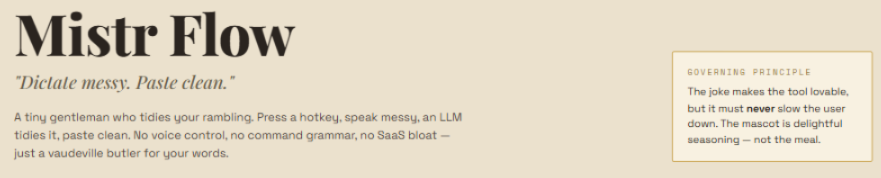
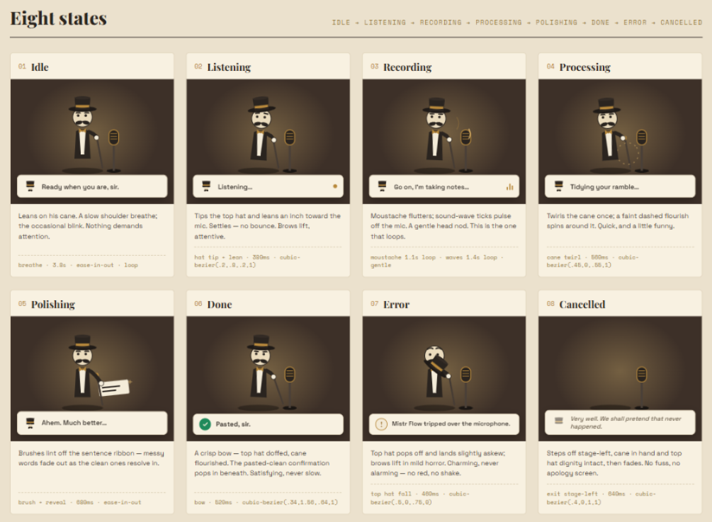

# Mistr Flow

> "Dictate messy. Paste clean."

Mistr Flow is a tiny Windows dictation app with manners. Press a hotkey, speak naturally, and it transcribes, lightly polishes, and pastes the result into whatever app you are already using.

No voice-control grammar. No command language. No SaaS dashboard. Just a cheerful little gentleman tidying your rambling into usable text.

This is a personal project, actively used day to day, and still evolving as the rough edges reveal themselves.



## What it does

- Starts dictation from a global hotkey: `Ctrl+Alt+D`.
- Records until you press the hotkey again.
- Sends the audio to Azure AI Foundry (Azure OpenAI) for transcription.
- Uses an LLM polish pass for punctuation, grammar, and spoken-list formatting.
- Copies the polished text to the clipboard and pastes it into the active app.
- Shows a small always-on-top overlay so you know what state it is in.
- Mutes system audio while recording by default, then restores it afterward.

The polish step is deliberately conservative: it should clean up words, not reinterpret them. Mistr Flow is meant to be a valet, not a ghostwriter.

## The eight states

The overlay is intentionally small and expressive. The mascot gives just enough feedback to be reassuring without stealing attention.



## Current shape

Mistr Flow is a personal Windows-first Electron app built with TypeScript. It currently assumes:

- Windows desktop.
- An Azure AI Foundry (Azure OpenAI) resource with a transcription deployment (e.g. `gpt-4o-transcribe`) and a chat deployment for polish (e.g. `gpt-5-mini`).
- English dictation.
- A hand-edited JSON config file rather than a settings UI.

## Setup

Install dependencies:

```sh
npm install
```

Create the config file at `%APPDATA%\MistrFlow\config.json`:

```json
{
  "azureEndpoint": "https://<your-resource>.cognitiveservices.azure.com/",
  "azureApiKey": "<azure-api-key>",
  "muteSystemAudioWhileRecording": true
}
```

`azureEndpoint` and `azureApiKey` come from your Azure AI Foundry resource (Keys and Endpoint). Optional fields:

- `azureApiVersion` (default `2025-04-01-preview`)
- `transcribeDeployment` (default `gpt-4o-transcribe`)
- `polishDeployment` (default `gpt-5-mini`)

These can also be supplied via the `AZURE_OPENAI_ENDPOINT`, `AZURE_OPENAI_API_KEY`, and `AZURE_OPENAI_API_VERSION` environment variables.

Build and run:

```sh
npm run build
npm start
```

Once running, press `Ctrl+Alt+D` to start recording, press it again to stop, and press `Esc` during a recording to cancel.

## Local Development

Install dependencies:

```sh
npm install
```

Start the app (compiles TypeScript then launches Electron):

```sh
npm start
```

Run the test suite:

```sh
npm test
```

For a type-check without building:

```sh
npm run typecheck
```

The production entry point is `src/main.ts`; the overlay lives in `public/overlay.html` and `public/overlay-renderer.js`. Design references and extracted mascot assets live under `docs/design/`.

## Design principle

The joke makes the tool lovable, but it must never slow the user down. The mascot is delightful seasoning — not the meal.
